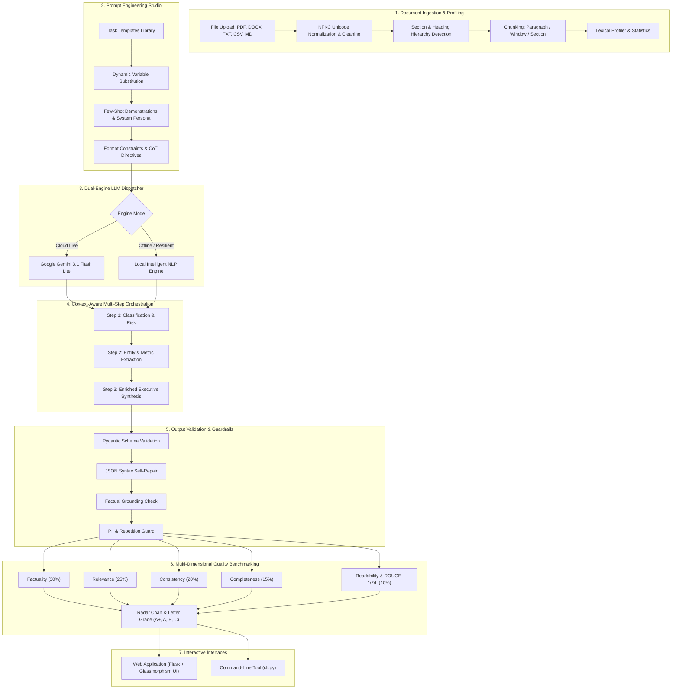

# AI-Powered Generative Content & Document Intelligence Platform

[](https://python.org)
[](https://ai.google.dev/)
[](https://flask.palletsprojects.com/)
[](https://docs.pydantic.dev/)
[](https://tailwindcss.com/)
[](https://www.chartjs.org/)

An enterprise-grade, end-to-end **AI-Powered Generative Content & Document Intelligence Platform** designed to ingest complex multi-format corporate files, execute context-aware multi-step generative workflows, enforce strict Pydantic schema validation, and evaluate outputs across quantitative quality benchmarks (Relevance, Consistency, Factuality, Readability, and ROUGE metrics).

---

## 📖 Short Project Description

Modern enterprise organizations process thousands of heterogeneous documents (contracts, financial reports, clinical protocols, technical specs) daily. This platform solves the challenge of turning unstructured, multi-format textual data into verified, actionable, structured intelligence. It bridges cutting-edge LLMs (**Google Gemini 3.1 Flash Lite / 3.5**) with deterministic NLP algorithms, automatic JSON syntax self-repair, Pydantic type validation, hallucination detection guards, and multi-dimensional benchmark scoring into a sleek, responsive Web Application and CLI tool.

---

## ✨ Main Features

- 📑 **Multi-Format Ingestion**: Ingests PDF, Word (`.docx`), CSV, JSON, Markdown, HTML, and Plain Text (`.txt`).
- ✂️ **Advanced Chunking Strategies**: Paragraph-aware semantic splitting, fixed sliding windows with overlap, and heading-based section chunking.
- 🎨 **Prompt Engineering Studio**: Pre-engineered prompt templates with few-shot demonstrations, system roles, and chain-of-thought (CoT) instructions across Summarization, Extraction, Classification, and Content Generation.
- ⚡ **Dual-Engine Orchestration**: Connects live to Google Gemini models with automatic failover, backed by a deterministic high-fidelity **Local NLP Engine** for 100% offline and zero-dependency reliability.
- 🔄 **Context-Aware Multi-Step DAG Workflows**: Sequenced pipelines where classification profiles and extracted entities feed directly into downstream executive synthesis.
- 🛡️ **Pydantic Schema Validation & JSON Self-Repair**: Enforces typed data contracts and automatically repairs common LLM syntax issues (markdown code fences, trailing commas, truncated brackets).
- 🔍 **Factual Grounding & Hallucination Guardrails**: Cross-verifies metrics, monetary amounts, percentages, and entities in generated outputs directly against source text chunks.
- 📊 **Multi-Dimensional Quality Evaluation**: Quantitative scoring across Factuality, Relevance, Consistency, Completeness, Readability (Flesch Reading Ease), and pure Python ROUGE-1/2/L overlap metrics.
- 📈 **Interactive Radar Benchmarks**: Visual evaluation results rendered on Chart.js radar charts with letter grades (A+, A, B, C, D) and actionable prompt-tuning recommendations.
- 🖥️ **Full-Stack Glassmorphism Web Interface**: Dark obsidian design with Cyber Emerald and Electric Cyan neon accents, responsive tabs, drag-and-drop upload, and instant export to Markdown/JSON.
- 💻 **Complete Command-Line Tool (`cli.py`)**: Scriptable terminal automation for batch ingestion, prompt runs, and pipeline execution.

---

## 🛠️ Technologies Used

| Layer | Technologies |
| :--- | :--- |
| **Backend & API** | Python 3.12, Flask 3.1, Flask-CORS, Werkzeug |
| **Generative AI** | Google Gemini API (`google-genai` SDK), Gemini 3.1 Flash Lite / 3.5 Flash |
| **Data Validation** | Pydantic v2 (typed schemas, BaseModel validation, field constraints) |
| **Document Processing** | `pypdf`, `python-docx`, Python CSV, JSON, Regex, Unicodedata |
| **NLP & Evaluation** | Custom pure-Python ROUGE-1/2/L engine, TF-IDF Cosine Similarity, Flesch Reading Ease, Syllable Analyzer |
| **Frontend UI** | HTML5, Tailwind CSS, Vanilla JavaScript, Chart.js, Lucide Icons |
| **Configuration** | `python-dotenv`, Environment variables, `.env.example` |
| **Testing** | Python `unittest` suite (13 comprehensive automated tests) |

---

## 🏛️ Project Workflow & Architecture



---

## 📱 Modules & Pages Walkthrough

### 1. Dashboard
- **Overview & Metrics**: Live health status, active model indicator, and total loaded documents.
- **Quick-Start Corpora**: 1-click loading for four realistic preloaded enterprise documents:
  - *Apex Dynamics FY2025 Annual Financial Report*
  - *NexaCorp & Vanguard Mutual Non-Disclosure Agreement*
  - *AVALON-3 Phase III Clinical Trial Study Report*
  - *Project Helios Banking Cloud Migration Specification*

### 2. Document Ingestion & Preprocessing
- **File Upload / Direct Paste**: Drag-and-drop support for PDF, DOCX, TXT, CSV, Markdown, and JSON.
- **Chunking Controls**: Configurable algorithms (`paragraph`, `fixed_window`, `section`) with customizable chunk size and overlap sliders.
- **Statistical Profiler**: Word count, estimated token count, chunk count, lexical diversity (Type-Token Ratio), top TF-IDF keywords, and structural section headers.

### 3. Prompt Engineering Studio
- **Template Selector**: Pre-engineered templates across 4 core tasks:
  - *Summarization*: Executive Briefing, Multi-Perspective Digest
  - *Extraction*: Entity & KPI Extraction, Strict JSON Schema Extraction
  - *Classification*: Document Taxonomy & Risk Assessment Matrix
  - *Content Generation*: Strategic Action Memo & Roadmap, High-Impact FAQ Knowledge Base
- **Customization Controls**: Temperature slider, audience specification, editable System Persona role, and chain-of-thought toggles.

### 4. Context-Aware Multi-Step Orchestration
- **Chained DAG Pipelines**: Sequenced execution where upstream artifacts enrich downstream generations:
  - *Step 1*: Document Classification & Risk Profiling
  - *Step 2*: Structured Entity & KPI Extraction
  - *Step 3*: Context-Aware Executive Synthesis
  - *Step 4*: Quality Assurance & Grounding Validation
  - *Step 5*: Multi-Dimensional Output Evaluation
- **Live Progress & Artifact Drawer**: Real-time progress bar, animated step indicators, and tabbed inspection of all intermediate and final artifacts.

### 5. Output Validation & Guardrail Checks
- **Pydantic Validation**: Real-time validation against the core `DocumentIntelligenceModel` schema.
- **JSON Self-Repair**: Automatic recovery from common markdown and syntax formatting errors.
- **Grounding Verification**: Counts total facts, verified facts in source text, and unverified facts with grounding ratio percentage.
- **PII & Safety Guard**: Scans for sensitive data (SSN, credit card patterns) and repetitive sentence loops.

### 6. Multi-Dimensional Quality Evaluation
- **Quantitative Metrics Breakdown**:
  - *Factuality & Grounding (30%)*: Verified claim ratio.
  - *Intent Relevance (25%)*: TF-IDF cosine similarity and keyword coverage.
  - *Narrative Consistency (20%)*: Internal semantic flow and contradiction check.
  - *Structural Completeness (15%)*: Section depth and formatting structure.
  - *Readability & Fluency (10%)*: Flesch Reading Ease score and clarity rating.
- **ROUGE Matrix**: Unigram (ROUGE-1), Bigram (ROUGE-2), and Longest Common Subsequence (ROUGE-L) Precision, Recall, and F1 scores.
- **Visual Radar Chart**: Chart.js radar visualization with letter grade badge and actionable prompt tuning suggestions.

---

## ⚙️ How the Application Works

1. **Ingestion & Profiling**: When a user uploads a document, the ingestor cleans the raw string (NFKC normalization), calculates linguistic statistics (word counts, tokens, lexical richness), identifies structural sections, and produces chunks according to the chosen strategy.
2. **Prompt Assembly**: The prompt engine combines the system persona, few-shot examples, document chunks, user directives, and format constraints into a rendered prompt.
3. **Model Generation**: The LLM client dispatches the prompt to Google Gemini (or the offline local engine).
4. **Context Passing**: In a multi-step pipeline, intermediate results (like extracted entities or risk scores) are added to the shared workflow context and injected into subsequent generation steps.
5. **Validation Guardrails**: The output validator inspects the generated output. If JSON is expected, it repairs any syntax errors and validates fields against the Pydantic schema. It also verifies that numbers and named entities are grounded in the source text.
6. **Multi-Criteria Scoring**: The evaluation engine computes cosine similarity, ROUGE scores, readability indices, and produces a weighted Quality Index with an interactive radar chart.

---

## 📥 Installation & Setup Guide

### 1. Clone the Repository
```bash
git clone https://github.com/shanthini-16/-AI-Powered-Generative-Content-Document-Intelligence-Platform.git
cd -AI-Powered-Generative-Content-Document-Intelligence-Platform
```

### 2. Create and Activate a Virtual Environment (Optional but Recommended)
```bash
python -m venv venv
# On Windows:
venv\Scripts\activate
# On macOS/Linux:
source venv/bin/activate
```

### 3. Install Dependencies
```bash
pip install -r requirements.txt
```

### 4. Configure the Gemini API Key
Duplicate `.env.example` into `.env`:
```bash
cp .env.example .env
```
Open `.env` and set your Google Gemini API key:
```env
GEMINI_API_KEY=your_actual_gemini_api_key_here
GEMINI_MODEL=gemini-3.1-flash-lite
ENGINE_MODE=auto
PORT=5050
HOST=127.0.0.1
DEBUG=True
```
> **Note**: You can obtain a free Gemini API key from [Google AI Studio](https://aistudio.google.com/).

### 5. Run the Web Application
```bash
python web/app.py
```
Open your browser and navigate to:
👉 **`http://127.0.0.1:5050`** *(or `http://localhost:5050`)*

---

## 💻 CLI Terminal Usage

Run batch processing and pipelines directly from your command line:

```bash
# 1. Ingest and profile a document
python cli.py ingest data/samples/annual_financial_report.txt --strategy paragraph

# 2. Execute a prompt with validation and evaluation
python cli.py run-prompt data/samples/annual_financial_report.txt --template sum_exec_brief --validate --evaluate

# 3. Execute a multi-step pipeline and export the result
python cli.py run-pipeline data/samples/cloud_migration_spec.txt --pipeline full_doc_intel --output-file output.md

# 4. Inspect registered templates and pipelines
python cli.py list-templates
python cli.py list-pipelines
```

---

## 🧪 Automated Testing

Run the automated test suite using Python's built-in `unittest` runner:
```bash
python -m unittest tests/test_all.py
```
Expected output:
```text
.............
----------------------------------------------------------------------
Ran 13 tests in 0.029s

OK
```

---

## 📌 Important Notes About the Project

- **Zero-Crash Resilience**: If no API key is provided, if network access is restricted, or if quota limits are reached, the platform seamlessly switches to the high-fidelity **Local NLP Engine** so all features (ingestion, prompt rendering, pipeline execution, validation, and evaluation) continue to function with zero errors.
- **Security & Privacy**: The `.gitignore` file strictly excludes `.env`, secrets, virtual environments, and temporary files. Never commit your `.env` file to version control.
- **Extensibility**: Custom prompt templates, Pydantic schemas, and workflow pipelines can be registered with a single method call in `core/prompt_engine.py` or `core/workflow_orchestrator.py`.
- **Pure Python Evaluation**: ROUGE-1, ROUGE-2, and ROUGE-L calculations are implemented purely in native Python, eliminating external heavy C-extension dependencies.
